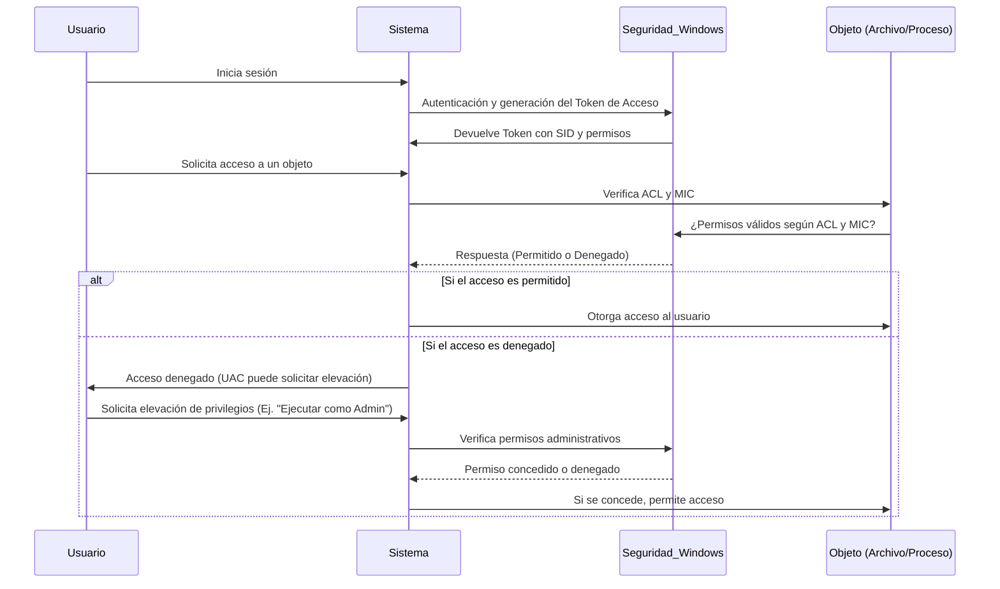

``` 
                   ┌───────────────────────────────┐
                   │   🔒 Seguridad en Windows     | 
                   └──────────────┬──────────────-─┘
                                  │
              ┌───────────────────┴───────────────────┐
              │                                       │
      🔹 Entidades                              🔹 Niveles de Integridad (MIC)
 ┌──────────────┬──────────────┐               ┌──────────────────────────────┐
 │ Usuarios     │  Grupos      │               │  System  (Máximo)            │
 │ - Cuentas    │ - Admins,    │               │  High (Administradores)      │
 │  individuales│   Usuarios   │               │  Medium (Usuarios Estándar)  │
 │              │   Invitados  │               │  Low (Procesos Restringidos) │
 │ Objetos      │              │               │  Untrusted (Sandbox)         │
 │ - Archivos,  │              │               └──────────────────────────────┘
 │   Carpetas,  │              │
 │   Claves Reg.│              │
 └──────────────┴──────────────┘
                                  │
                                  ▼
                     🔄 **Proceso de Asignación de Permisos**
 ┌────────────────────────────────────────────────────────────┐
 │ 1️⃣ **Creación del Objeto**                                  |
 │      - Se asigna un propietario (Usuario/Grupo).           │
 │ 2️⃣ **Generación del Token de Acceso 🔑 **                   │   
 │      - Se incluyen credenciales, SID y grupos.             │
 │      - Se asignan privilegios (Ej.: Act as System).        │
 │ 3️⃣ **Evaluación de la ACL (Access Control List)**           │
 │      - Se comparan permisos con la DACL del objeto.        │
 │ 4️⃣ **Aplicación del Mandatory Integrity Control (MIC)**     │
 │      - Se bloquea la escalación de privilegios.            │
 │ 5️⃣ **User Account Control (UAC) y Elevación de Privilegios**│
 │      - Se requiere confirmación para ejecutar como Admin.  │
 └────────────────────────────────────────────────────────────┘

```
### Diagrama UML


### Diagrama Secuencial


