``` 
                   ┌───────────────────────────────┐
                   │   🔒 Seguridad en Windows     | 
                   └──────────────┬──────────────-─┘
                                  │
              ┌───────────────────┴───────────────────┐
              │                                       │
      🔹 Entidades                              🔹 Niveles de Integridad (MIC)
 ┌──────────────┬──────────────┐               ┌──────────────────────────────┐
 │ Usuarios     │  Grupos      │               │  System  (Máximo)            │
 │ - Cuentas    │ - Admins,    │               │  High (Administradores)      │
 │  individuales│   Usuarios   │               │  Medium (Usuarios Estándar)  │
 │              │   Invitados  │               │  Low (Procesos Restringidos) │
 │ Objetos      │              │               │  Untrusted (Sandbox)         │
 │ - Archivos,  │              │               └──────────────────────────────┘
 │   Carpetas,  │              │
 │   Claves Reg.│              │
 └──────────────┴──────────────┘
                                  │
                                  ▼
                     🔄 **Proceso de Asignación de Permisos**
 ┌────────────────────────────────────────────────────────────┐
 │ 1️⃣ **Creación del Objeto**                                  |
 │      - Se asigna un propietario (Usuario/Grupo).           │
 │ 2️⃣ **Generación del Token de Acceso 🔑 **                   │   
 │      - Se incluyen credenciales, SID y grupos.             │
 │      - Se asignan privilegios (Ej.: Act as System).        │
 │ 3️⃣ **Evaluación de la ACL (Access Control List)**           │
 │      - Se comparan permisos con la DACL del objeto.        │
 │ 4️⃣ **Aplicación del Mandatory Integrity Control (MIC)**     │
 │      - Se bloquea la escalación de privilegios.            │
 │ 5️⃣ **User Account Control (UAC) y Elevación de Privilegios**│
 │      - Se requiere confirmación para ejecutar como Admin.  │
 └────────────────────────────────────────────────────────────┘

```
### Diagrama UML

```mermaid
graph
 
  A[Seguridad en Windows]--> | Define Permisos y Restricciones | B(Usuarios y Grupos)
  A-->C(Niveles de Integridad - MIC)
  
  B-->B1[Usuarios]
  B-->B2[Grupos]
  B1-->|Tiene permisos sobre| D[(Objetos, Archivos, Carpetas, Claves de Registro)]
  B2-->|Administra permisos| D

  D-->|Protegido por|E{ACL - Lista de Control de Accesos}
  E-->|Define acceso|F[DACL - Control Discecional]
  E-->|Registra eventos|G[SACL - Auditoria]

  D-->|Validacion|H(Proceso de Evaluacion de Permisos)
  H-->|Token de acceso generalizado|I[Token de Acceso]
  I-->|Verifica nieveles|C
  C -->|Impide escalar| J{Restricciones por Integridad}
  
  J -->|Si es necesario| K[UAC - Elevación de Privilegios]
  K -->|Aprueba o deniega| L(Acceso Final al Objeto)

```



### Diagrama Secuencial

```mermaid
sequenceDiagram
  participant Usuario
  participant Sistema
  participant Seguridad_Windows
  participant Objeto (Archivo/Proceso)
  
  Usuario->>Sistema: Inicia sesión
  Sistema->>Seguridad_Windows: Autenticación y generación del Token de Acceso
  Seguridad_Windows->>Sistema: Devuelve Token con SID y permisos
  
  Usuario->>Sistema: Solicita acceso a un objeto
  Sistema->>Objeto (Archivo/Proceso): Verifica ACL y MIC
  Objeto (Archivo/Proceso)->>Seguridad_Windows: ¿Permisos válidos según ACL y MIC?
  Seguridad_Windows-->>Sistema: Respuesta (Permitido o Denegado)
  
  alt Si el acceso es permitido
    Sistema->>Objeto (Archivo/Proceso): Otorga acceso al usuario
  else Si el acceso es denegado
    Sistema->>Usuario: Acceso denegado (UAC puede solicitar elevación)
    Usuario->>Sistema: Solicita elevación de privilegios (Ej. "Ejecutar como Admin")
    Sistema->>Seguridad_Windows: Verifica permisos administrativos
    Seguridad_Windows-->>Sistema: Permiso concedido o denegado
    Sistema->>Objeto (Archivo/Proceso): Si se concede, permite acceso
  end

```


